# Analisis Struktur Kode: Sistem Pengiriman Barang

> Terakhir diperbarui: 2026-06-13
> Perubahan dari versi sebelumnya: hapus `users.vehicle_id`, `shipments.distance`, `manifests.arrived_at`

## Arsitektur yang Digunakan

Proyek ini menggunakan **Laravel MVC (Model-View-Controller)** dengan pola **Role-Based Access Control (RBAC)**. Tidak ada layer Service atau Repository — seluruh business logic ditangani langsung di dalam Controller.

Arsitektur terbagi menjadi dua area fungsional utama:
- **Admin** — prefix `/admin`, middleware `role:admin`
- **Kurir** — prefix `/courier`, middleware `role:kurir`

Satu route publik tersedia untuk tracking pengiriman tanpa autentikasi.

---

## Daftar Entitas/Class dan Tanggung Jawabnya

### Enum

| Class | Tanggung Jawab |
|---|---|
| `ShipmentStatus` | Mendefinisikan status valid pengiriman: `Diproses`, `Terjadwal`, `Dalam Perjalanan`, `Tiba di Tujuan`, `Dalam Pengantaran`, `Diterima`, `Penundaan Pengiriman` |

### Models

| Class | Tabel | Tanggung Jawab |
|---|---|---|
| `User` | `users` | Data pengguna (admin & kurir). Field kurir: `courier_code`, `nik`, `phone`, `sim_number`, `sim_type`, `address`, `status`. Soft deletes. |
| `Shipment` | `shipments` | Entitas inti pengiriman. Menyimpan data pengirim, penerima, rute, berat, biaya, status. Observer otomatis mencatat tracking setiap perubahan status. Soft deletes. |
| `Manifest` | `manifests` | Mengelompokkan beberapa Shipment dalam satu paket pengiriman. Terhubung ke kurir dan kendaraan. Accessor `load_percentage`. Soft deletes. |
| `ShipmentTracking` | `shipment_trackings` | Riwayat perubahan status per Shipment. Dicatat otomatis via observer di Shipment. |
| `ShippingRate` | `shipping_rates` | Tabel master tarif pengiriman per rute (origin → destination): `cost_per_kg`, `estimated_distance_km` (informatif), `jalur_pengiriman`. |
| `Vehicle` | `vehicles` | Data kendaraan: plat nomor, tipe, kapasitas (Kg), status. Soft deletes. |
| `ProofOfDelivery` | `proof_of_deliveries` | Bukti serah terima: foto (Cloudinary), nama penerima, waktu serah terima. One-to-one dengan Shipment. |

### Middleware

| Class | Tanggung Jawab |
|---|---|
| `CheckRole` | Memvalidasi role pengguna (`admin` / `kurir`). Redirect ke dashboard masing-masing jika tidak berwenang. |

### Controllers (Admin)

| Class | Tanggung Jawab |
|---|---|
| `Admin\DashboardController` | Statistik ringkas: pengiriman aktif, kurir, terselesaikan, tertunda. Grafik 7 hari & top 3 kurir. |
| `Admin\UserController` | CRUD pengguna. Auto-generate `courier_code`. Validasi field khusus kurir. |
| `Admin\CourierController` | Daftar kurir (read-only). |
| `Admin\ShipmentController` | CRUD pengiriman. Kalkulasi biaya & validasi rute dari `ShippingRate`. Generate nomor resi. AJAX endpoint dropdown kota & tarif. |
| `Admin\ManifestController` | CRUD manifest. Manajemen kapasitas kendaraan, assignment kurir, perubahan status pengiriman massal. DB Transaction. |
| `Admin\VehicleController` | CRUD kendaraan. Format plat ke uppercase. |
| `Admin\ShippingRateController` | CRUD tarif pengiriman. Normalisasi nama kota ke Title Case. Validasi duplikasi rute. |
| `Admin\ReportController` | Laporan pengiriman dan performa kurir berdasarkan rentang tanggal. |

### Controllers (Kurir)

| Class | Tanggung Jawab |
|---|---|
| `Courier\DashboardController` | Manifest aktif kurir. `startJourney`: catat `departed_at` dan ubah status pengiriman massal. |
| `Courier\ManifestController` | Tandai manifest selesai. Bebaskan status kendaraan ke `Tersedia`. |
| `Courier\ShipmentController` | Daftar pengiriman aktif. Update status oleh kurir. Upload foto POD ke Cloudinary saat `Diterima`. |
| `Courier\HistoryController` | Riwayat pengiriman selesai untuk kurir yang login. |

### Controllers (Publik)

| Class | Tanggung Jawab |
|---|---|
| `AuthController` | Login, logout, redirect berdasarkan role. |
| `TrackingController` | Halaman tracking publik berdasarkan nomor resi. |

---

## Skema Database (Kolom Aktif)

### `users`
`id`, `name`, `email`, `password`, `email_verified_at`, `role`, `courier_code`, `nik`, `phone`, `sim_number`, `sim_type`, `address`, `status`, `remember_token`, `created_at`, `updated_at`, `deleted_at`

### `shipments`
`id`, `tracking_number`, `sender_name`, `sender_phone`, `sender_address`, `receiver_name`, `receiver_phone`, `receiver_address`, `origin_city`, `destination_city`, `jalur_pengiriman`, `item_description`, `jumlah_koli`, `weight`, `shipping_cost`, `manifest_id`, `current_status`, `created_at`, `updated_at`, `deleted_at`

### `manifests`
`id`, `manifest_code`, `courier_id`, `vehicle_id`, `jalur_pengiriman`, `total_weight`, `total_shipments`, `status`, `notes`, `departed_at`, `created_at`, `updated_at`, `deleted_at`

### `vehicles`
`id`, `license_plate`, `type`, `capacity`, `status`, `created_at`, `updated_at`, `deleted_at`

### `shipping_rates`
`id`, `origin_city`, `destination_city`, `cost_per_kg`, `estimated_distance_km`, `jalur_pengiriman`, `created_at`, `updated_at`

### `shipment_trackings`
`id`, `shipment_id`, `status`, `notes`, `recorded_by`, `created_at`, `updated_at`

### `proof_of_deliveries`
`id`, `shipment_id`, `photo_path`, `received_by_name`, `delivered_at`, `created_at`, `updated_at`

---

## Alur Status Pengiriman

```
Diproses ──► Terjadwal ──► Dalam Perjalanan ──► Tiba di Tujuan ──► Dalam Pengantaran ──► Diterima
                       └──► Penundaan Pengiriman ──────────────────────────────────────► Dalam Pengantaran ──► Diterima
```

## Alur Manifest

```
[Admin] Buat Manifest (Persiapan)
    → [Admin] Tambah Shipment + Assign Kurir + Kendaraan
    → [Admin] Berangkatkan (Sedang Jalan)
    → [Kurir] Mulai Perjalanan (catat departed_at)
    → [Kurir] Update status tiap Shipment
    → [Kurir] Selesaikan Manifest → Vehicle kembali ke Tersedia
```

---

## Class Diagram (Mermaid.js)

```mermaid
classDiagram
    direction TB

    class ShipmentStatus {
        <<enumeration>>
        DIPROSES = "Diproses"
        TERJADWAL = "Terjadwal"
        DALAM_PERJALANAN = "Dalam Perjalanan"
        TIBA_DI_TUJUAN = "Tiba di Tujuan"
        DALAM_PENGANTARAN = "Dalam Pengantaran"
        DITERIMA = "Diterima"
        PENUNDAAN = "Penundaan Pengiriman"
    }

    class User {
        +int id
        +string name
        +string email
        +string password
        +string role
        +string courier_code
        +string nik
        +string phone
        +string sim_number
        +string sim_type
        +string address
        +string status
        +datetime deleted_at
        +shipments() HasMany
        +manifests() HasMany
    }

    class Vehicle {
        +int id
        +string license_plate
        +string type
        +decimal capacity
        +string status
        +datetime deleted_at
        +manifests() HasMany
    }

    class ShippingRate {
        +int id
        +string origin_city
        +string destination_city
        +decimal cost_per_kg
        +decimal estimated_distance_km
        +string jalur_pengiriman
        +scopeRoute()
        +scopeJalur()
    }

    class Manifest {
        +int id
        +string manifest_code
        +int courier_id
        +int vehicle_id
        +string jalur_pengiriman
        +decimal total_weight
        +int total_shipments
        +string status
        +string notes
        +datetime departed_at
        +datetime deleted_at
        +courier() BelongsTo
        +vehicle() BelongsTo
        +shipments() HasMany
        +getLoadPercentageAttribute()
    }

    class Shipment {
        +int id
        +string tracking_number
        +string sender_name
        +string sender_phone
        +string sender_address
        +string receiver_name
        +string receiver_phone
        +string receiver_address
        +string origin_city
        +string destination_city
        +string jalur_pengiriman
        +string item_description
        +int jumlah_koli
        +decimal weight
        +decimal shipping_cost
        +int manifest_id
        +ShipmentStatus current_status
        +datetime deleted_at
        +manifest() BelongsTo
        +trackings() HasMany
        +proofOfDelivery() HasOne
        +scopePending()
    }

    class ShipmentTracking {
        +int id
        +int shipment_id
        +ShipmentStatus status
        +string notes
        +int recorded_by
        +shipment() BelongsTo
        +recordedBy() BelongsTo
    }

    class ProofOfDelivery {
        +int id
        +int shipment_id
        +string photo_path
        +string received_by_name
        +datetime delivered_at
        +shipment() BelongsTo
        +getPhotoUrlAttribute()
    }

    class CheckRole {
        <<middleware>>
        +handle(Request, Closure, string role)
    }

    class AuthController {
        <<controller>>
        +index()
        +authenticate(Request)
        +logout(Request)
    }

    class TrackingController {
        <<controller>>
        +index(Request)
    }

    class Admin_DashboardController {
        <<controller>>
        +index()
    }

    class Admin_UserController {
        <<controller>>
        +index(Request)
        +store(Request)
        +update(Request, User)
        +destroy(User)
    }

    class Admin_ShipmentController {
        <<controller>>
        +index(Request)
        +create()
        +store(Request)
        +show(Shipment)
        +edit(Shipment)
        +update(Request, Shipment)
        +destroy(id)
        +ajaxDestinations(Request)
        +ajaxRate(Request)
    }

    class Admin_ManifestController {
        <<controller>>
        +index()
        +create()
        +store(Request)
        +show(Manifest)
        +edit(Manifest)
        +update(Request, Manifest)
        +destroy(Manifest)
        +berangkatkan(Manifest)
        -generateManifestCode()
    }

    class Admin_VehicleController {
        <<controller>>
        +index()
        +store(Request)
        +update(Request, Vehicle)
        +destroy(Vehicle)
    }

    class Admin_ShippingRateController {
        <<controller>>
        +index()
        +store(Request)
        +update(Request, id)
        +destroy(id)
    }

    class Admin_ReportController {
        <<controller>>
        +index()
        +generate(Request)
        -generateShipmentReport(start, end)
        -generateCourierReport(start, end)
    }

    class Courier_DashboardController {
        <<controller>>
        +index()
        +startJourney(Manifest)
    }

    class Courier_ManifestController {
        <<controller>>
        +complete(Manifest)
    }

    class Courier_ShipmentController {
        <<controller>>
        +index()
        +updateStatus(Request, Shipment)
    }

    class Courier_HistoryController {
        <<controller>>
        +index(Request)
    }

    %% Database Relationships
    User "1" --> "0..*" Shipment : courier_id
    User "1" --> "0..*" Manifest : courier_id
    User "1" --> "0..*" ShipmentTracking : recorded_by

    Vehicle "1" --> "0..*" Manifest : vehicle_id

    Manifest "1" --> "0..*" Shipment : manifest_id

    Shipment "1" --> "0..*" ShipmentTracking : shipment_id
    Shipment "1" --> "0..1" ProofOfDelivery : shipment_id

    Shipment ..> ShipmentStatus : uses
    ShipmentTracking ..> ShipmentStatus : uses

    %% Controller → Model dependencies
    Admin_ShipmentController ..> Shipment : manages
    Admin_ShipmentController ..> ShippingRate : reads
    Admin_ManifestController ..> Manifest : manages
    Admin_ManifestController ..> Shipment : updates
    Admin_ManifestController ..> Vehicle : updates
    Admin_UserController ..> User : manages
    Admin_VehicleController ..> Vehicle : manages
    Admin_ShippingRateController ..> ShippingRate : manages
    Admin_DashboardController ..> Shipment : reads
    Admin_DashboardController ..> User : reads
    Admin_ReportController ..> Shipment : reads
    Admin_ReportController ..> Manifest : reads

    Courier_DashboardController ..> Manifest : reads
    Courier_DashboardController ..> Shipment : updates
    Courier_ShipmentController ..> Shipment : updates
    Courier_ShipmentController ..> ProofOfDelivery : creates
    Courier_ManifestController ..> Manifest : updates
    Courier_ManifestController ..> Vehicle : updates
    Courier_HistoryController ..> Shipment : reads

    TrackingController ..> Shipment : reads
    TrackingController ..> ShipmentTracking : reads
```



---

## Catatan Teknis

| Aspek | Detail |
|---|---|
| **Framework** | Laravel (PHP) |
| **Auth** | Laravel Auth bawaan + middleware `CheckRole` |
| **File Storage** | Cloudinary (upload foto POD via base64) |
| **Soft Deletes** | Aktif di: `User`, `Shipment`, `Manifest`, `Vehicle` |
| **Database Transactions** | Digunakan di `Admin\ManifestController::store()` dan `update()` |
| **Observer Pattern** | `Shipment` model: otomatis mencatat `ShipmentTracking` setiap perubahan status |
| **Form Request** | Tidak ada — validasi inline di controller |
| **Service Layer** | Tidak ada — business logic langsung di controller |
| **Pagination** | Semua halaman list menggunakan pagination |
